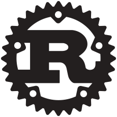
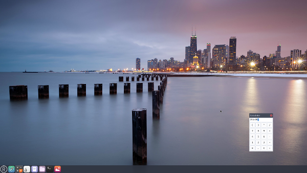

<!-- .element: style="margin-top: -5%;" -->
## Introduction

#### [Mario Garcia](http://mariog.xyz) · [@mariogmd](https://twitter.com/mariogmd)

---

## What is Rust?

***

### A systems programming language focus on:

<br>

<span class="fragment">safety</span><span class="fragment">, speed</span><span class="fragment">, and concurrency.</span>

<!-- .element: class="fragment" -->

---

## Installing Rust

### Linux or Mac:

```
  $ curl https://sh.rustup.rs -sSf | sh
```

***

- Available for Windows, GNU/Linux, Mac
- Support for X86, X86-64 & ARM<!-- .element: class="fragment" -->
- Rust 1.20.0 (stable)<!-- .element: class="fragment" -->

***

```
  $ rustc --version
  rustc 1.20.0 (f3d6973f4 2017-08-27)
```

---

## IDEs

***

## Atom

_[atom.io](https://atom.io)_

***

## SolidOak

_[sekao.net/solidoak](https://sekao.net/solidoak)_

***

## Ride

_[github.com/madeso/ride](https://github.com/madeso/ride)_

---

## Rust Sintax

---

## Print text

```
  println!("string {} literal", expressions);
```

***

```
  // hello.rs
  fn main() {
      println!("Hello, world!");
  }
```

***

## Comments

```
  // This is a comment
```

---

## Running

```
  $ rustc hello.rs
  $ ./hello
  Hello, world!
```

---

## variables

```
  let name = expression;
```

***

## Example

```
  fn main () {
      let a = 7;
      let b = 8;
      println!("The sum is: {}", a+b);
  }
```

***

## Mutability

```
  let mut nombre = expression;
```

---

## Primitive Types

---

## Numeric Types

- i8, i16, i32, i64
- u8, u16, u32, u64<!-- .element: class="fragment" -->
- f32, f64<!-- .element: class="fragment" -->
- isize, usize<!-- .element: class="fragment" -->

***

```
  let x = 42; // x has type i32
  let y = 1.0; // y has type f64
```

---

## String

```
  let x = 'x';
```

---

## Boolean

```
  let x = true;
  let y: bool = true;
```

---

## Decision making

```
  if condicion {
      expressions;
  }
  else {
      expressions;
  }
```

***

## Example

```
  fn main() {
      let a = 8;
      let b = 12;
      if a > b {
          println!("{} > {}", a, b);
      }
      else {
          println!("{} > {}", b, a);
      }
  }
```

---

## Arrays

```
  let a = [1, 2, 3]; // a: [i32; 3]
  let mut m = [1, 2, 3]; // m: [i32; 3]
```

---

## Loops

***

```
  for i in x..n {
      expressions;
  }
```

***

```
  while condition {
      expressions;
  }
```

***

## Examples

***

```
  fn main () {
      let a = [1, 2, 3, 4, 5];
      for i in 0..5 {
          println!("{}", a[i]);
      }
  }
```

***

```
  fn main () {
      let a = [1, 2, 3, 4, 5];
      let mut i = 0;
      while i < 5 {
          println!("{}", a[i]);
          i = i +1;
      }
  }
```

---

## functions

```
  fn name(arg: Type) -> ReturnType {
      statements;
  }
```

---

## Example

```
  fn main () {
      let a = 9;
      let b = 15;
      println("La suma es: {}", suma(a, b));
  }
  fn sum(a: i32, b: i32) -> i32 {
      let c = a + b;
      return c;
  }
```

---


## Cargo

---

## What is Cargo?

***

### Cargo is Rust’s build system and package manager.

---

## New project with Cargo

```
  $ cargo new hello_world --bin
```

***

```
  ~/hello_world$ ls -R 
```

***

```
  .:
  Cargo.toml src

  ./src:
  main.rs
```

---

## Manifest

```
  [package]
  name = "hello_world" # the name of the package
  version = "0.1.0"    # the current version
  authors = ["mattdark"] # author
```

---

## Build & Run

```
  $ cargo build
  $ cargo run
```

---

## Projects

---

## Servo

_[servo.org](https://servo.org)_

***

## What is Servo?

***

#### Servo is a modern, performant browser engine designed to be appropriate for applications including embedded use.

---

## intermezzOS

_[intermezzos.github.io](https://intermezzoss.github.io)_

***

## What is intermezzOS?

***

#### intermezzOS is a teaching operating system, specifically focused on introducing systems programming concepts to experienced developers from other areas of programming.

---

## Redox

_[redox-os.org](https://redox-os.org)_

***



***

## What is Redox?

***

#### Redox is a Unix-like Operating System written in Rust, aiming to bring the innovations of Rust to a modern microkernel and full set of applications.

---

## Meetups

***


<!-- .element: style="margin-top: -5%;" --> 
### Rust MX

***

### Rust MX

_[meetup.com/es/Rust-MX](https//meetup.com/es/Rust-MX)_

___

[@rustlang_mx](https://twitter.com/rustlang_mx)

***

### Rust Tuxtla

_[meetup.com/es/Rust-Tuxtla](https//meetup.com/es/Rust-Tuxtla)_

___

[rust-tuxtla.github.io](https://rust-tuxtla.github.io)

---

## Learn More

_[rust-lang.org](https//rust-lang.org)_

___

[@mariogmd](https://twitter.com/mariogmd)

[fb.com/iscmariog](https://fb.com/iscmariog)

mattdark@mozilla-mexico.org
